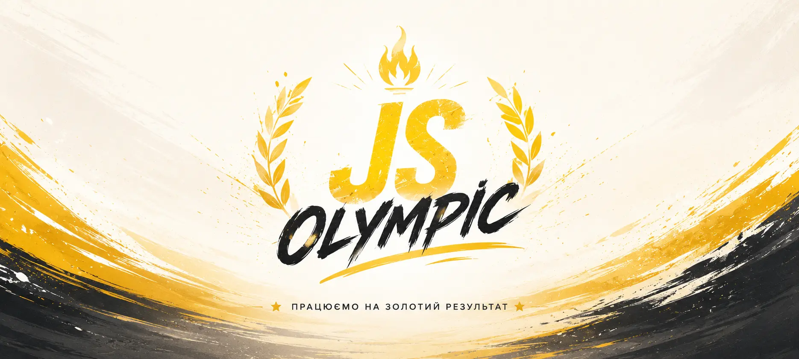

<div align="center">



# YourEnergy

**Тренуйся розумно. Заряджайся енергією.**

_Фінальний командний проєкт курсу JavaScript від команди_ **JS Olympic** 🏅

[](https://vitejs.dev/)
[](#)
[](#)
[](#)
[](#)
[](https://your-natka.github.io/Our-project/)

[🌐 Live Demo](https://your-natka.github.io/Our-project/) ·
[🎨 Figma](https://www.figma.com/design/1ifqGcQBIzMoc21yIqyV5q/YourEnergy?node-id=2-186)
· [⚡ API](https://your-energy.b.goit.study/api) ·
[🐛 Issues](https://github.com/Your-Natka/Our-project/issues)

</div>

---

## ✨ Про проєкт

**YourEnergy** — це сучасний вебзастосунок для тих, хто хоче тримати себе у
формі. Знайди вправу за групою мʼязів, частиною тіла чи інвентарем, переглянь
техніку виконання, додай улюблене в обране та читай мотивуючу цитату дня.

Проєкт реалізований як **SPA-подібний мультисторінковий застосунок** на Vite, з
ручною композицією HTML-партіалів, модульним CSS і чистою архітектурою на
vanilla JS/TS — без жодного фреймворку.

## 🚀 Можливості

- 🏷️ **Категорії вправ** — перемикання між `Muscles`, `Body parts`, `Equipment`
- 🔍 **Розумний пошук та фільтрація** вправ у вибраній категорії
- 💪 **Картки вправ** із рейтингом, рівнем складності та групою мʼязів
- 🪟 **Модальне вікно** з детальним описом вправи та можливістю оцінити її
- ❤️ **Обране** — збереження улюблених вправ у `localStorage`
- 💬 **Цитата дня** — щоденна порція мотивації з API
- 📄 **Пагінація** результатів
- 📱 **Повністю адаптивний дизайн** (Mobile / Tablet / Desktop)
- 🍔 **Бургер-меню** для мобільних пристроїв
- 🔔 **Toast-сповіщення** через [iziToast](https://izitoast.marcelodolza.com/)

## 🛠️ Технології

| Категорія      | Інструменти                                                                       |
| -------------- | --------------------------------------------------------------------------------- |
| **Збірка**     | [Vite](https://vitejs.dev/), `vite-plugin-html-inject`, `vite-plugin-full-reload` |
| **Мови**       | JavaScript (ES2022+), TypeScript, HTML5, CSS3                                     |
| **Стилі**      | Modern Normalize, PostCSS, `postcss-sort-media-queries`, DM Sans (Google Fonts)   |
| **UX**         | iziToast (нотифікації), власні модалки, бургер-меню                               |
| **API**        | [Your Energy API](https://your-energy.b.goit.study/api) (GoIT)                    |
| **Деплой**     | GitHub Actions → GitHub Pages                                                     |
| **Code style** | Prettier, EditorConfig                                                            |

## 📁 Структура проєкту

```
Our-project/
├── src/
│   ├── api/              # Робота з REST API (exercises, filters, quote)
│   ├── assets/           # Іконки, шрифти, sprite.svg
│   ├── css/              # base / components / layout / utils / styles.css
│   ├── features/         # Бізнес-логіка фіч (exercises, filters)
│   ├── helpers/          # Допоміжні утиліти
│   ├── js/               # Загальна JS-логіка
│   ├── modal/            # Логіка модальних вікон
│   ├── pages/            # Точки входу для сторінок
│   ├── partials/         # HTML-партіали (header, hero, exercises, …)
│   ├── render/           # Рендер-функції для карток та списків
│   ├── services/         # Сервіси (favorites, rating, тощо)
│   ├── storage/          # Робота з localStorage
│   ├── ts/               # TypeScript-модулі
│   ├── index.html        # Головна сторінка
│   ├── favorites.html    # Сторінка обраного
│   └── main.js           # Точка входу застосунку
│
├── team-logo.webp        # Логотип команди JS Olympic
├── vite.config.js
├── tsconfig.json
└── package.json
```

## ⚡ Швидкий старт

> Потрібен **Node.js LTS** (≥ 18).

```bash
# 1. Клонуй репозиторій
git clone https://github.com/Your-Natka/Our-project.git
cd Our-project

# 2. Встанови залежності
npm install

# 3. Запусти dev-сервер
npm run dev
```

Після цього застосунок буде доступний за адресою
[http://localhost:5173](http://localhost:5173) з гарячим перезавантаженням.

### Доступні скрипти

| Команда           | Опис                                        |
| ----------------- | ------------------------------------------- |
| `npm run dev`     | Запустити dev-сервер з HMR                  |
| `npm run build`   | Зібрати продакшн-версію в `dist/`           |
| `npm run preview` | Запустити локальний preview зібраної версії |

## 🌐 API

Проєкт використовує публічне REST API GoIT:

```
https://your-energy.b.goit.study/api
```

Основні ендпоінти, що використовуються:

- `GET /filters?filter={category}` — список категорій (Muscles / Body parts /
  Equipment)
- `GET /exercises?{params}` — список вправ з фільтрами та пагінацією
- `GET /exercises/:id` — деталі вправи
- `PATCH /exercises/:id/rating` — оновлення рейтингу
- `GET /quote` — цитата дня

## 🚢 Деплой

Продакшн-версія автоматично збирається й деплоїться на **GitHub Pages** (гілка
`gh-pages`) після кожного оновлення `main` — через GitHub Action
`.github/workflows/deploy.yml`.

> Не забудь у `package.json` тримати правильний `--base=/Our-project/` для
> команди `build`, інакше CSS/JS не підвантажаться на продакшені.

## 👥 Команда JS Olympic

<div align="center">

| Учасник       | GitHub                               |
| ------------- | ------------------------------------ |
| Mykola Masiuk | [@mykolamasiuk](https://github.com/) |

</div>

## 🎨 Дизайн

Макет проєкту створено в Figma:
**[YourEnergy — Figma file](https://www.figma.com/design/1ifqGcQBIzMoc21yIqyV5q/YourEnergy?node-id=2-186)**

## 📄 Ліцензія

Проєкт створений в освітніх цілях у рамках курсу **GoIT JavaScript**.

---

<div align="center">

Made with ❤️ and a lot of ☕ by **JS Olympic**

</div>
