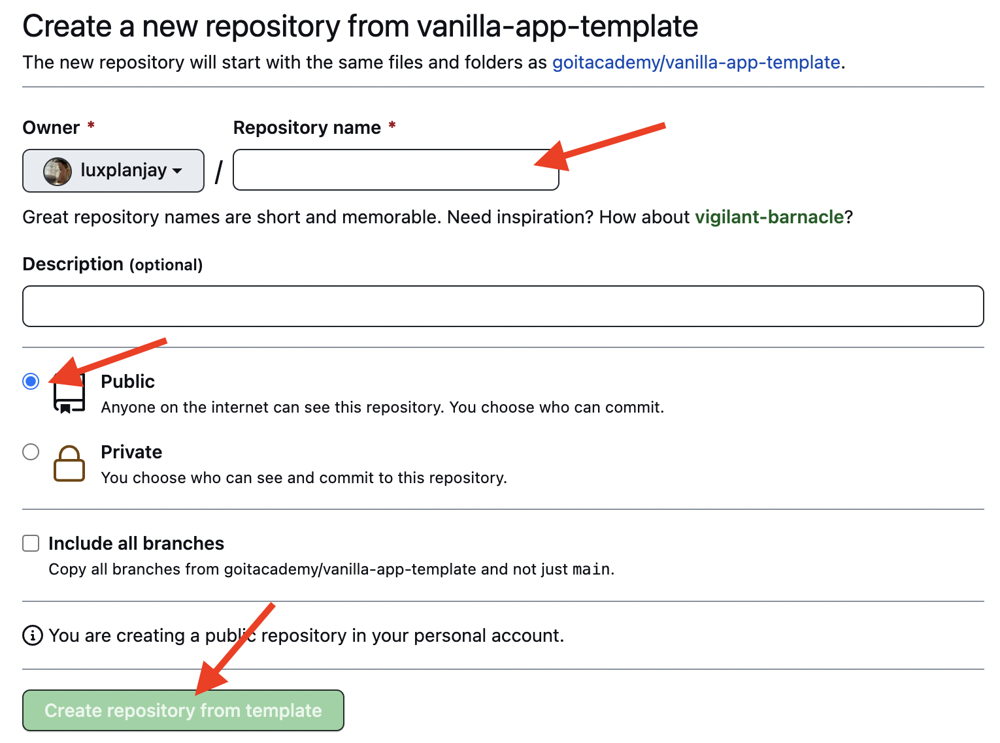
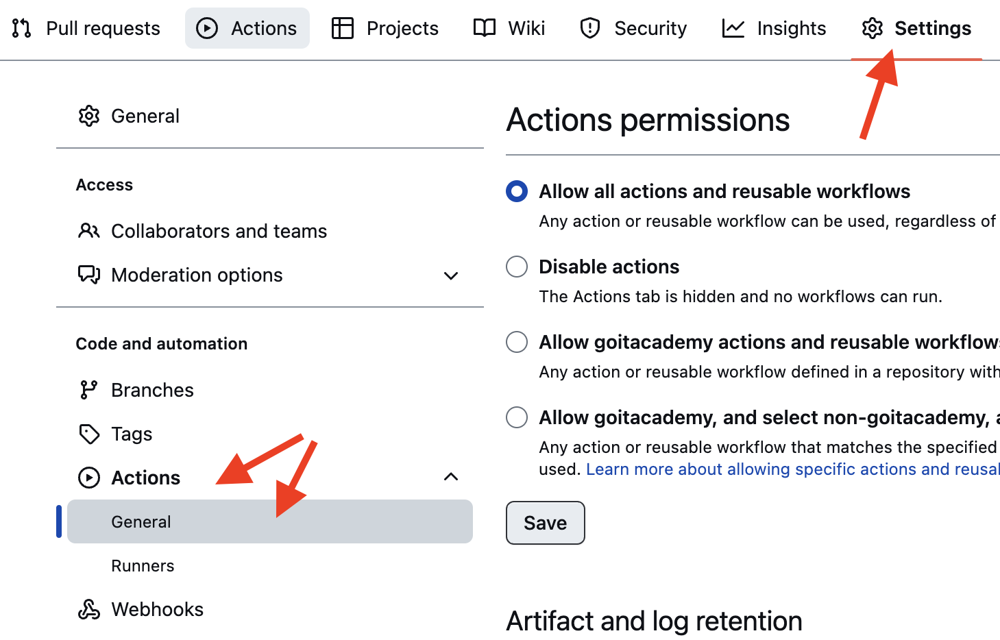
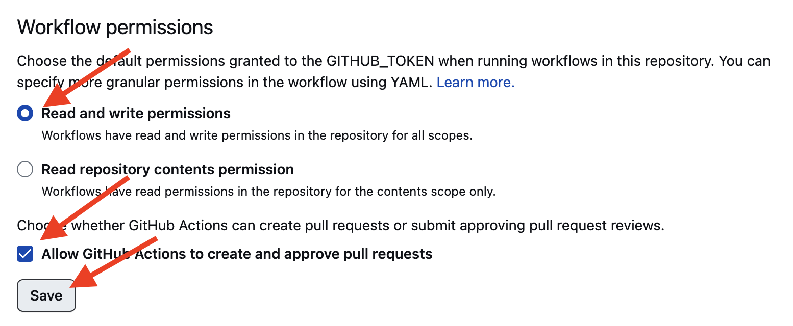

# Vanilla App Template

Цей проект було створено за допомогою Vite. Для знайомства та налаштування
додаткових можливостей [звернись до документації](https://vitejs.dev/).

## Створення репозиторію за шаблоном

Використовуй цей репозиторій організації GoIT як шаблон для створення
репозиторію свого проекту. Для цього натисни на кнопку `«Use this template»` і
обери опцію `«Create a new repository»`, як показано на зображенні.

На наступному етапі відкриється сторінка створення нового репозиторію. Заповни
поле його імені, переконайся, що репозиторій публічний, після чого натисни
кнопку `«Create repository from template»`.

Після того, як репозиторій буде створено, необхідно перейти в налаштування
створеного репозиторію на вкладку `Settings` > `Actions` > `General` як показано
на зображенні.

Проскроливши сторінку до самого кінця, в секції `«Workflow permissions»` обери
опцію `«Read and write permissions»` і постав галочку в чекбоксі. Це необхідно
для автоматизації процесу деплою проекту.

Тепер у тебе є особистий репозиторій проекту, зі структурою файлів та папок
репозиторію-шаблону. Далі працюй з ним, як з будь-яким іншим особистим
репозиторієм, клонуй його собі на комп'ютер, пиши код, роби коміти та відправляй
їх на GitHub.

## Підготовка до роботи

1. Переконайся, що на комп'ютері встановлено LTS-версію Node.js.
   [Скачай та встанови](https://nodejs.org/en/) її якщо необхідно.
2. Встанови базові залежності проекту в терміналі командою `npm install`.
3. Запусти режим розробки, виконавши в терміналі команду `npm run dev`.
4. Перейдіть у браузері за адресою
   [http://localhost:5173](http://localhost:5173). Ця сторінка буде автоматично
   перезавантажуватись після збереження змін у файли проекту.

## Файли і папки

- Файли розмітки компонентів сторінки повинні лежати в папці `src/partials` та
  імпортуватись до файлу `index.html`. Наприклад, файл з розміткою хедера
  `header.html` створюємо у папці `partials` та імпортуємо в `index.html`.
- Файли стилів повинні лежати в папці `src/css` та імпортуватись до HTML-файлів
  сторінок. Наприклад, для `index.html` файл стилів називається `index.css`.
- Зображення додавай до папки `src/img`. Збирач оптимізує їх, але тільки при
  деплої продакшн версії проекту. Все це відбувається у хмарі, щоб не
  навантажувати твій комп'ютер, тому що на слабких компʼютерах це може зайняти
  багато часу.

## Деплой

Продакшн-версія автоматично збирається й деплоїться на **GitHub Pages** (гілка
`gh-pages`) після кожного оновлення `main` — через GitHub Action
`.github/workflows/deploy.yml`.

> Не забудь у `package.json` тримати правильний `--base=/Our-project/` для
> команди `build`, інакше CSS/JS не підвантажаться на продакшені.

## 👥 Команда JS Olympic

| Учасник               | GitHub                                       |
| --------------------- | -------------------------------------------- |
| Natalia Bodnarchuk    | [@Your-Natka](https://github.com/Your-Natka) |
| Oksana Miazina        | [@PoppyHanna](https://github.com/PoppyHanna) |
| Maks Lukyanenko       | [@MaksL777](https://github.com/MaksL777)     |
| Mykola Masiuk         | [@mykolamasiuk](https://github.com/)         |
| Volodymyr Burtsev     | [@voksus](https://github.com/voksus)         |
| Yakiv Tsypin (Zexler) | [@Zexler](https://github.com/Zexler)         |
| Hanna Fedko           | [@PoppyHanna](https://github.com/PoppyHanna) |
| Oleksandr Tovkailo    | [@Tovchik](https://github.com/Tovchik)       |

## 🎨 Дизайн

Макет проєкту створено в Figma:
**[YourEnergy — Figma file](https://www.figma.com/design/1ifqGcQBIzMoc21yIqyV5q/YourEnergy?node-id=2-186)**

## 📄 Ліцензія

Проєкт створений в освітніх цілях у рамках курсу **GoIT JavaScript**.

---

Made with ❤️ and a lot of ☕ by **JS Olympic**

